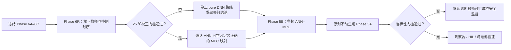
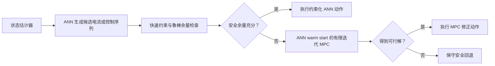

# Phase 6R 与 Phase 5B：面向鲁棒动力电池快充的 ANN–MPC 后续研究方案

## 1. 结论先行

项目下一阶段不建议投入大量时间逐参数复现论文的 EHM 案例，也不建议忽略
Phase 6A–6C 暴露的问题，直接沿用旧 ANN 继续扩大压力测试。

推荐路线为：

1. 先建立独立的 **Phase 6R**，只修正 MPC 教师标签、控制时序和状态闭合问题；
2. Phase 6R 只做离线测试和 25 ℃名义闭环，并设置严格停止条件；
3. 随后回到项目主线，开展 **Phase 5B 鲁棒 ANN–MPC**；
4. 最终控制器采用“ANN 快速提议 + 显式约束 + 必要时 MPC 修正/回退”，
   不再把无保护 pure DNN 作为唯一工程方案；
5. Phase 5B 通过后，再进入观察器、HIL 和跨电池验证。

总体顺序：



## 2. 为什么不把完整论文复现作为主线

【论文依据】Shokry 等人的方法证明了：在低维、已知可行域和数值模型场景中，
小型 DNN 可以学习 MPC 产生的状态—动作映射，并显著减少在线计算时间。论文案例
的有效状态维数为 2 或 3，EHM 案例采用 1 min 采样。论文同时承认，该方法尚未
覆盖更高维、更强非线性的物理电池模型及真实扰动条件。

【项目证据】本项目的最终目标不是复现 EHM 数值结果，而是在 Chen2020 电池、
5 s 控制周期、温度和参数扰动条件下，使用 ANN 降低 MPC 在线计算量，同时保持
约束与充电性能。因此，完整复现论文只能作为方法学习或基线验证，不能直接解决
Phase 5A 的高温鲁棒性问题。

只有出现以下情况之一时，才将完整论文复现升级为独立主任务：

- 导师明确要求逐参数复现论文；
- 毕业或投稿工作需要报告可比的 EHM 原始案例；
- 需要排除本地实现与论文算法之间的所有差异；
- 能获得作者代码、完整参数和可核对的原始数据。

## 3. 已确认的项目事实

### 3.1 Phase 5A 暴露的工程问题

- 69 个降阶压力场景完成率为 68.12%；
- 物理安全率为 65.22%；
- 最大实质安全层介入率为 55.83%；
- 15 ℃和 25 ℃ DFN 锚点完成；
- 30 ℃ DFN 在 60 min 内未到达 80% SOC；
- 30 ℃安全层介入率为 91.39%；
- 主要失败模式是 ANN 缺少提前管理热预算的能力，接近温度边界后才由安全层
  强制大幅减流。

### 3.2 Phase 6A–6C 暴露的方法问题

- pure DNN 在名义闭环中不能准确复现 MPC；
- 输出投影能够修正部分电流/斜率越界，但不能修复整体映射误差；
- 单纯增加样本、网络规模或更换优化器没有达到 1% NRMSE 门槛；
- 结构化增量输出改善了闭环误差，但不能保证全部约束；
- Phase 6C 三类控制器均为 0/5 严格通过，因此按预设规则停止 Phase 6D。

### 3.3 新发现的关键根因

当前训练数据不是严格的五维静态状态反馈映射。

训练数据生成过程对每个初态只求解一次 MPC，再将分块开环控制序列展开成 8 个
监督样本。由于每个控制块重复 5 个 5 s 步长，训练标签表现为：

- step 1–4 电流保持不变；
- step 5 集中发生下一控制块跳变；
- step 6–7 再次保持不变。

DNN 输入没有控制块位置或重优化计数器，因此实际标签更接近：

$$
I_k^*=\pi(x_k,q_k,m_k),
$$

其中：

- $x_k$：电池状态；
- $q_k$：控制块相位或距下一次重优化的步数；
- $m_k$：教师控制器的内部模式或记忆。

但当前 DNN 假设：

$$
I_k=\hat\pi(x_k).
$$

当 $q_k$ 和 $m_k$ 未提供时，相似的五维状态可能对应相差 2 A 的教师标签。
均方误差训练会在这些动作之间取折中，而不是恢复真正的控制模式。

一次只读辅助消融表明，在同一冻结测试集和同一小型网络下：

| 输入 | 冻结测试 NRMSE |
|---|---:|
| 原五维状态 | 5.620% |
| 五维状态 + step index | 1.124% |
| 五维状态 + 控制块相位 | 0.850% |
| 五维状态 + step one-hot | 0.921% |

该消融不是正式 Phase 6C 结果，但强烈支持“控制模式变量缺失”解释。最终控制器
不应直接依赖训练轨迹行号；应修正教师标签定义或使 ANN 与 MPC 使用完全一致的
控制调度。

此外，MPC 内部使用核心温度和表面温度，而当前 DNN 只使用平均温度。对于相同
平均温度、不同核心—表面温差的状态，未来温升和最优动作可能不同。因此当前五维
输入还存在热状态不闭合问题。

## 4. Phase 6R：教师策略与状态闭合校正

### 4.1 Phase 6R 的唯一研究问题

> 当训练教师、闭环教师、控制时序和输入状态完全一致时，ANN 能否在 25 ℃名义
> 条件下逼近 MPC？

Phase 6R 是有限的因果校正实验，不是 Phase 6D，也不运行 15/30 ℃、Phase 5A
扰动或跨电池验证。

### 4.2 数据生成原则

首选方案是滚动时域第一动作标注：

1. 从一个可达状态 $x_k$ 开始；
2. 在该状态重新求解 MPC；
3. 只保存第一步最优动作：

$$
I_k^*=\operatorname{MPC}(x_k)[0];
$$

4. 将该动作施加到模型，得到 $x_{k+1}$；
5. 在 $x_{k+1}$ 重新求解 MPC；
6. 重复上述过程。

禁止继续将同一次 MPC 求解得到的后续开环控制块直接作为新的静态状态反馈标签，
除非控制块相位和全部控制器内部状态被明确纳入输入，并且闭环执行同样的调度器。

### 4.3 教师一致性要求

训练教师和验证教师必须统一：

- 控制周期；
- 重优化周期；
- 控制分块长度；
- 斜率约束语义；
- 初始猜测与 warm start 规则；
- 目标函数；
- 状态变量；
- 终止条件；
- 约束收紧；
- 模型参数。

在生成大规模数据前，先建立一个自动一致性测试：对若干相同状态，数据生成器返回
的标签必须与闭环 MPC 在该状态实际执行的第一动作一致，允许误差建议不超过
`1e-6 A` 或求解器数值容差。

### 4.4 ANN 输入候选

如果 MPC 使用完整双节点热状态，ANN 输入至少应包含：

$$
x_k=
[SOC,v_f,v_s,T_{\mathrm{core}},T_{\mathrm{surface}},
T_{\mathrm{amb}},I_{k-1}].
$$

如果工程上只能测量平均温度，应明确采用以下一种方式：

- 建立核心/表面温度状态估计器；
- 让 MPC 与 ANN 都只使用可观测的平均温度模型；
- 或承认 ANN 不能严格复制使用完整热状态的教师。

### 4.5 数据隔离

- Phase 6A、6B、6C 的配置、数据、模型、指标和报告保持不变；
- Phase 6R 使用独立目录、配置、数据、模型、图和报告；
- 修正后的标签定义发生变化，因此不得继续把旧 Phase 6B 冻结测试集当作新的正式
  教师测试集；
- 应重新建立 Phase 6R 冻结测试集，并按完整轨迹或完整初态分组隔离；
- 旧测试集只作为历史对照，不用于宣称新方法通过。

### 4.6 建议对照组

1. 原五维 pure DNN；
2. 补全热状态后的 pure DNN；
3. 结构化电流输出 DNN；
4. MPC 教师；
5. 可选诊断组：显式加入控制模式变量，但只用于确认根因，不直接作为最终控制器。

### 4.7 Phase 6R 验收门槛

- 新冻结测试集电流 NRMSE `< 1%`；
- 25 ℃降阶闭环电流 NRMSE `< 1%`；
- 25 ℃ DFN 闭环电流 NRMSE `< 1%`；
- 相对同一 MPC 教师的充电时间偏差 `< 2%`；
- 无严重电压、温度、电流和斜率违约；
- 推理速度相对完整 MPC `> 100×`；
- 至少 3–5 个种子，多数种子通过完整门槛。

若修正后仍明显高于 1%–2%，停止 pure DNN 论文式替代路线。无论 Phase 6R 是否
通过，都不在该阶段继续扩大到多温度和参数扰动；这些属于 Phase 5B。

## 5. Phase 5B：鲁棒 ANN–MPC 主线

### 5.1 研究目标

Phase 5B 的目标不是让 ANN 无保护地替代 MPC，而是：

> 利用约束感知 ANN 学习 MPC 策略并生成快速候选控制，在不确定性和约束边界
> 附近由 MPC 自适应修正，从而降低平均在线计算量，并保持动力电池快充安全性与
> 完成率。

该方向与项目目标一致，但其学术创新性尚未确认，必须在写论文或申请课题前进行
独立文献检索和现有方法对比。

## 6. Phase 5B-0：先建立 MPC 可行性边界

在训练 ANN v3 前，先在 Phase 5A 原有场景中运行完整 MPC 或定义清楚的鲁棒 MPC，
回答：

- MPC 自己能否在 60 min 内到达 80% SOC？
- MPC 自己是否满足全部物理约束？
- 30 ℃失败是 ANN 模仿失败，还是控制目标在该场景下本身不可行？
- 高内阻、低热容、高热阻组合下，安全到达目标 SOC 的最短时间是多少？
- 参数失配条件下，名义 MPC 与知道真实参数的 oracle MPC 差距有多大？

将场景分成：

1. 教师可行、ANN 失败；
2. 教师与 ANN 都不可行；
3. 教师与 ANN 都可行；
4. 名义教师失败、oracle 教师可行。

ANN 训练和主要改进应优先针对第一类；第二类不能直接计为 ANN 模仿失败。

Phase 5B-0 的输出至少包括：

- 场景级可行性表；
- 教师安全率、完成率和充电时间；
- 约束激活统计；
- 不可行原因分类；
- 后续 ANN 验收时可使用的教师可行场景掩码。

## 7. Phase 5B-1：鲁棒教师数据

教师数据重点覆盖：

- 27–30 ℃高温；
- 高内阻；
- 低热容；
- 高热阻；
- 不利产热参数；
- 温度接近 MPC 收紧边界；
- Phase 5A 高安全层介入区域；
- Phase 5A 未完成或斜率违约轨迹；
- SOC、温度和极化状态估计误差；
- ANN 闭环实际访问的 DAgger 状态。

每个状态应使用统一教师重新求解，并只保存教师实际执行的第一步动作。数据中保存：

- 场景参数；
- 状态真值和控制器可观测/估计状态；
- 教师动作；
- 活动约束；
- 各约束余量；
- 求解状态和回退信息；
- 数据来源；
- 完整场景 ID。

训练、验证和测试集按完整扰动场景隔离，不允许同一参数场景跨集合。

## 8. Phase 5B-2：ANN v3

### 8.1 输入建议

ANN v3 输入应围绕“提前管理热预算”设计，而不是只增加网络层数。候选输入包括：

- SOC；
- 两个极化电压；
- 核心与表面温度，或可验证的热状态估计；
- 环境温度；
- 上一步电流；
- 温度约束余量；
- 电压约束余量；
- 可辨识的容量/内阻/热参数特征；
- 状态估计不确定性或置信区间。

不能直接把仿真中可获得、真实系统中不可观测且没有估计器支持的参数作为最终部署
输入。可将其用于 oracle 对照，但必须与工程控制器分开报告。

### 8.2 结构化电流输出

建议使用同时保证绝对电流和斜率约束的可行区间参数化：

$$
L_k=\max(0,I_{k-1}-\Delta I_{\max}),
$$

$$
U_k=\min(I_{\max},I_{k-1}+\Delta I_{\max}),
$$

$$
I_k=
\frac{L_k+U_k}{2}
+
\frac{U_k-L_k}{2}\tanh(z_k).
$$

这样天然满足：

$$
0\le I_k\le I_{\max},
\qquad
|I_k-I_{k-1}|\le\Delta I_{\max}.
$$

该结构不能保证电压和温度约束，因此仍需要预测余量、安全监督或 MPC 修正。

### 8.3 训练评价

除了总体 NRMSE，还应报告：

- 教师可行场景上的 NRMSE；
- 高温、高内阻和低热容分区误差；
- 温度/电压/斜率约束临界区误差；
- 最大绝对误差；
- 多种子均值和标准差；
- 分布外场景误差；
- 闭环访问状态上的 DAgger 误差；
- 预测约束余量的校准情况。

## 9. Phase 5B-3：推荐的 ANN–MPC 混合控制器



ANN 可以承担以下功能：

- 直接给出安全余量充分区域中的动作；
- 预测 MPC 的第一动作；
- 预测整段控制序列，作为 MPC 初始解；
- 预测活动约束或约束余量；
- 判断是否需要调用 MPC；
- 在接近约束边界时触发更严格的修正。

需要明确记录：

- ANN 直接执行比例；
- 有限迭代 MPC 调用率；
- 完整 MPC 回退率；
- 平均/最大求解时间；
- MPC 迭代次数；
- warm start 相对普通 MPC 的加速；
- 安全回退是否导致斜率约束违约。

## 10. Phase 5B-4：原封不动重跑 Phase 5A

至少比较以下控制器：

| 控制器 | 作用 |
|---|---|
| 完整 MPC | 性能与安全教师基线 |
| 原 ANN v2 + 原安全层 | 历史基线 |
| ANN v3 + 结构化输出 | 检查快速策略本体 |
| ANN v3 + 原安全层 | 判断数据和输入改进贡献 |
| ANN 提议 + 有限迭代 MPC | 推荐主方法 |
| 必要时完整 MPC 回退 | 最终安全架构 |

Phase 5A 的69个场景、15/25/30 ℃ DFN 锚点和既有门槛必须保持不变，防止在看到
结果后修改测试标准。

主要验收门槛：

- 降阶场景完成率 `>= 95%`；
- 降阶物理安全率 `= 100%`；
- 最大实质安全干预率 `<= 20%`；
- 15/25/30 ℃ DFN 锚点全部安全完成；
- 单个 DFN 锚点充电时间 `<= 60 min`，前提是 MPC 教师证明该目标可行；
- ANN/MPC 混合控制器平均在线时间显著低于完整 MPC；
- 相对完整 MPC 的充电时间差和能量/热负荷差应预先规定；
- 报告 MPC 调用率、回退率和最坏求解时间，而不只报告平均速度。

若 MPC 教师在某场景本身不可行，应单独报告，不得通过删除场景或降低物理门槛
让 ANN 获得表面上的通过。

## 11. 阶段目录与产物隔离

建议新建而不是复用旧阶段目录：

```text
configs/
  phase6r_corrected_policy_distillation.yaml
  phase5b0_mpc_feasibility_envelope.yaml
  phase5b1_robust_teacher_data.yaml
  phase5b2_ann_v3.yaml
  phase5b3_hybrid_ann_mpc.yaml

data/
  phase6r_corrected_policy_distillation/
  phase5b_mpc_feasibility/
  phase5b_robust_teacher/
  phase5b_hybrid_validation/

outputs/
  metrics/phase6r_*.json
  metrics/phase5b_*.json
  figures/phase6r_*.png
  figures/phase5b_*.png
  phase6r_report.md
  phase5b_report.md

docs/
  phase6r_corrected_policy_distillation.md
  phase5b_robust_ann_mpc.md
```

不得覆盖：

- Phase 5A 的场景和正式指标；
- Phase 6A、6B、6C 的数据、配置、模型和报告；
- Phase 6B/6C 冻结测试集；
- Git 标签 `phase6b-baseline`；
- 已推送的 Phase 6C 分支记录。

## 12. 明确禁止事项

- 不要把 `step_index` 当成最终物理控制器的快捷输入；
- 不要继续用开环控制块展开标签训练无记忆 DNN，再与滚动 MPC 比较；
- 不要只扩大网络或样本数而不修正教师策略定义；
- 不要降低 35 ℃、4.2 V、电流或斜率物理门槛来获得通过；
- 不要把安全层强制修正后的结果解释为 ANN 本体学会了约束；
- 不要将教师本身不可行的场景直接计为 ANN 模仿失败；
- 不要在 Phase 5B 通过前更换电池；
- 不要在仿真阶段宣称可直接部署到 BMS；
- 不要把潜在方法组合直接宣称为学术创新，必须先做文献检索；
- 不要覆盖或重写 Phase 6A–6C 的失败记录。

## 13. 新任务启动检查清单

新任务开始后按以下顺序执行：

1. 阅读本文件；
2. 阅读 `HANDOFF.md`；
3. 阅读 `outputs/phase5a_report.md` 和 `outputs/metrics/phase5a_metrics.json`；
4. 阅读 `outputs/phase6c_report.md` 和
   `docs/phase6c_constraint_regime_learning.md`；
5. 核对 Git 当前分支、远程状态和未提交文件；
6. 不清理、不重置、不覆盖现有工作区；
7. 为 Phase 6R 创建独立配置、目录、报告和测试；
8. 先写教师一致性单元测试，再生成数据；
9. 只运行 Phase 6R 的离线与 25 ℃名义验证；
10. 根据预设停止条件结束 Phase 6R；
11. 进入 Phase 5B-0，先建立 MPC 可行性边界；
12. 再决定 Phase 5B-1 的鲁棒教师采样范围。

## 14. 建议给新任务的直接指令

可以将下面这段作为下一任务的开场要求：

> 阅读 `docs/phase6r_phase5b_ann_mpc_research_plan.md`、`HANDOFF.md`、Phase 5A
> 与 Phase 6C 报告。保持 Phase 5A 和 Phase 6A–6C 全部产物不变。先独立实现
> Phase 6R：统一训练教师与闭环教师的控制时序，对每个状态重新求解 MPC 并只标注
> 第一动作，补全热状态输入，建立新的冻结测试集，只运行离线、25 ℃降阶和 25 ℃
> DFN 验证，并按文档门槛停止。完成 Phase 6R 后，再规划 Phase 5B-0 的 MPC
> 可行性边界实验。不要运行 Phase 6D、15/30 ℃、Phase 5A 扰动或跨电池实验，
> 除非相应前置门槛已经通过。

## 15. 证据边界与未决问题

当前已经能够确认：

- Phase 5A 的主要工程问题是高温/参数扰动下 ANN 缺少热预算意识；
- Phase 6A–6C 的 pure DNN 在当前配置下未通过；
- 当前 Phase 6 数据标签含有未进入 DNN 输入的控制块相位；
- 输出投影不能修复控制律拟合误差；
- ANN 在线推理速度不是当前瓶颈。

尚未确认：

- 修正教师标签后 pure DNN 是否能稳定低于 1% NRMSE；
- 完整 MPC 在所有 Phase 5A 场景中是否可行；
- 30 ℃在当前约束和 60 min 门槛下是否存在可行控制轨迹；
- 哪些参数和状态在真实 BMS 中可观测或可可靠估计；
- ANN warm start 能将 MPC 平均和最坏求解时间降低多少；
- 推荐混合架构相对现有研究是否具有足够学术新颖性。

下一任务的最高价值动作是：**实现教师第一动作一致性测试，并建立 Phase 6R 的最小
校正数据生成原型。**
